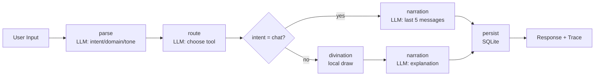

# Oracle's Choice

A SpoonOS Graph Agent–powered oracle app that can **chat empathetically** or **run divination** on demand. It uses **DeepSeek** as the LLM provider, stores session history, and exposes the full workflow trace (Input → Processing → Output).

The UI and the assistant are **bilingual (中文 / English)**: pick a language in the sidebar, and the bot will reply in whatever language you write in.

---

## Screenshots


## ✨ Features

- **Dual mode**: normal chat (contextual) or forced divination.
- **Graph Agent workflow**: `parse → route → divination → narration → persist`.
- **LLM routing** for intent/domain/tone/tool selection.
- **Local divination** (tarot/lenormand/liuyao) for deterministic card draws.
- **Context memory**: last 5 messages per session are injected into chat replies.
- **Trace transparency**: full decision trace returned to UI (deduped to 5 nodes).
- **LLM provider**: DeepSeek (`deepseek-chat` by default). The `LLMClient` wrapper is provider-agnostic, but `backend/app/main.py` currently enables only DeepSeek.
- **Bilingual UI**: instant `中文 / English` switch in the sidebar; choice persisted per browser.
- **Bilingual chat**: the assistant replies in the same language as the user; mixed input follows the dominant language.

---

## 🌐 Bilingual Support

Originally Chinese-only; both the UI and the chatbot now support English alongside Chinese.

### UI

- A `中文 / English` switcher sits in the sidebar.
- Switching is instant. The choice is saved to `localStorage` under `oracle.lang`.
- On first visit the browser language is used (`zh-*` → Chinese UI, `en-*` → English UI; otherwise Chinese).
- The browser tab title and `<html lang>` follow the active language.
- All translations live in `frontend/src/i18n/translations.js`. To add a new visible string, add the key to both the `zh` and `en` blocks and reference it via `t("key")`.

### Chatbot reply language

- Chinese input → Chinese reply.
- English input → English reply.
- Mixed input → the **dominant language** wins. CJK characters are weighted 3× to reflect their higher information density, so a short Chinese phrase mixed with a few English modifiers (e.g. `今天面试 a bit nervous`) stays Chinese, while an English sentence with a Chinese opener (e.g. `我感觉很 anxious about my interview tomorrow`) is treated as English.
- Empty / punctuation-only / ambiguous input defaults to Chinese, preserving the original project behavior.
- The assistant does **not** automatically translate the user's words. To get a translation, ask explicitly (e.g. *"Please translate this into English"* / *"请帮我翻译成英文"*).
- Detection happens in `backend/app/agent/lang.py` (`detect_language`). The detected value is threaded through agent state and shown in the parse trace as `lang`.

### Divination cards

- Card data (Tarot / Lenormand / Liuyao) remains in Chinese as authentic source material.
- The `narration` LLM rewrites verdict and advice into the user's language while preserving the reading's meaning.
- If the LLM call fails, the rule-based fallback returns Chinese for Chinese sessions and English for English sessions; in the rare English-fallback path, embedded card terms may still appear in Chinese.

---

## 🧱 Architecture Overview

### Backend workflow (SpoonOS Graph Agent)
```
parse (LLM) → route (LLM) → divination (local) → narration (LLM) → persist (db)
```

- **parse**: classifies intent (`chat` / `divination`), domain, tone, clarification need.
- **route**: picks tool (`tarot` / `lenormand` / `liuyao`) for divination.
- **divination**: local draw with deterministic seed.
- **narration**: generates final response (chat or divination explanation).
- **persist**: writes message + reading + trace to SQLite.

### Frontend workflow
- User enters prompt
- Optional **Divination** button
- Sends `force_divination` flag to backend
- Renders response + optional trace + structured result

---

## 📦 Project Structure

```
Oracle-s-Choice/
├── backend/
│   ├── app/
│   │   ├── agent/
│   │   │   ├── graph_agent.py     # SpoonOS Graph Agent (language-aware prompts)
│   │   │   ├── lang.py             # bilingual language detector (zh / en)
│   │   │   ├── llm_client.py       # LLM wrapper with fallback
│   │   │   └── nodes.py            # rules, keywords, bilingual fallback narration
│   │   ├── divination/             # tarot / lenormand / liuyao
│   │   ├── storage/                # sqlite persistence
│   │   └── main.py                 # FastAPI entry
│   ├── .env.example
│   └── requirements.txt
├── frontend/
│   ├── src/
│   │   ├── App.jsx
│   │   ├── components/
│   │   │   └── LanguageSwitcher.jsx   # 中文 / English toggle
│   │   ├── i18n/
│   │   │   ├── LanguageContext.jsx    # provider, useLanguage(), t(...)
│   │   │   └── translations.js        # zh / en dictionary
│   │   ├── main.jsx
│   │   └── styles.css
│   ├── index.html
│   ├── .env.example
│   └── package.json
└── README.md
```

---

## ✅ Requirements

- **Python 3.12+** (required by SpoonOS)
- Node.js 18+ (frontend)

---

## 🔧 Setup (SpoonOS SDK)

SpoonOS is not on PyPI; install from source.

```powershell
cd D:\VSCode\VSCodeProject

git clone https://github.com/XSpoonAi/spoon-core.git
cd spoon-core

py -3.12 -m venv spoon-env
.\spoon-env\Scripts\Activate.ps1
pip install -r requirements.txt
pip install -e .
```

---

## 🔧 Backend Setup

```powershell
cd D:\VSCode\VSCodeProject\CasualHackathon\Oracle-s-Choice\backend

py -3.12 -m venv .venv
.\.venv\Scripts\Activate.ps1

pip install -r requirements.txt
pip install -e D:\VSCode\VSCodeProject\spoon-core
```

### Environment Variables

Copy example:
```powershell
copy .env.example .env
```

The active LLM provider is **DeepSeek**, so the only key you must fill in is:
```
DEEPSEEK_API_KEY=your-deepseek-key
```

`backend/.env.example` also lists `OPENAI_API_KEY` and `GEMINI_API_KEY` as
forward-compatible placeholders — leave them blank unless you also wire the
extra provider into `backend/app/main.py` (currently it calls
`_filter_providers(["deepseek"])`, so other keys are ignored at runtime).
Optional tuning vars (`DEEPSEEK_MODEL`, `LLM_MAX_TOKENS`, `LLM_RETRIES`,
`ORACLE_CHOICE_DB_PATH`) are documented in `backend/.env.example`.

---

## 🔧 Frontend Setup

```powershell
cd D:\VSCode\VSCodeProject\CasualHackathon\Oracle-s-Choice\frontend

npm install
```

`.env` (frontend):
```
VITE_API_URL=http://127.0.0.1:8001
```

---

## ▶️ Run

### Backend
```powershell
cd backend
.\.venv\Scripts\Activate.ps1
python -m uvicorn app.main:app --reload --host 127.0.0.1 --port 8001
```

### Frontend
```powershell
cd frontend
npm run dev
```

---

## 🧠 Chat vs Divination Modes

### Automatic Mode (default)
- User just types normally.
- LLM decides if this is a chat or divination request.

### Force Divination
- Click **Divination** in UI.
- Forces divination flow regardless of intent.

### Context Handling
- Chat mode includes the **last 5 messages** of the session.

---

## 🔍 API

### POST `/chat`

Request:
```json
{
  "session_id": "uuid-optional",
  "message": "user question",
  "force_divination": false
}
```

Response:
```json
{
  "session_id": "uuid",
  "message": "final response",
  "tool": "tarot|lenormand|liuyao|chat",
  "trace": [
    { "node": "parse", "input": {...}, "output": {...} },
    { "node": "route", "input": {...}, "output": {...} },
    { "node": "divination", "input": {...}, "output": {...} },
    { "node": "narration", "input": {...}, "output": {...} },
    { "node": "persist", "input": {...}, "output": {...} }
  ],
  "reading": {
    "symbols": [...],
    "verdict": "...",
    "advice": ["...", "...", "..."]
  }
}
```

---

## 🧾 Database

SQLite DB file: `backend/oracle_choice.db`

Tables:
- `sessions`
- `messages`
- `readings`
- `agent_traces`

---

## 🔄 SpoonOS Requirements Coverage

✅ **Must use SpoonOS**: Graph Agent uses `spoon_ai.graph.StateGraph`
✅ **Agent system**: Graph Agent with explicit workflow
✅ **Core feature integration**: LLM routing + response generation is central
✅ **Input → Processing → Output**: explicit trace per node

---

## 🧪 Troubleshooting

### `ModuleNotFoundError: spoon_ai`
- SpoonOS not installed into the backend venv
- Re‑run:
  ```powershell
  pip install -e D:\VSCode\VSCodeProject\spoon-core
  ```

### `Rate limit exceeded` / DeepSeek errors
- Confirm `DEEPSEEK_API_KEY` is set and your DeepSeek account has quota.
- Lower `LLM_MAX_TOKENS` or raise `LLM_RETRIES` in `.env`.
- Optionally switch model via `DEEPSEEK_MODEL` (default `deepseek-chat`).

### Frontend not hitting backend
- Ensure `frontend/.env` has correct `VITE_API_URL`
- Restart `npm run dev`

---

## 📌 Notes

- Divination draws are **local and deterministic**.
- LLM is used for **intent + routing + narration**.
- Trace is always returned and displayed in UI for transparency.

---

## 🚢 Deployment Notes (Pre-Launch Checklist)

This project is currently configured for **local development only**. The items below are *not yet implemented* — they are reminders for when you put the app on a public server.

1. **CORS** — `backend/app/main.py` currently uses `allow_origins=["*"]`. Restrict it to your actual frontend domain(s) before going public.
2. **API keys** — never commit `.env`. Provide `DEEPSEEK_API_KEY` (and any other provider keys you enable) only via environment variables on the server. `.env` and `.env.*` are already in `.gitignore`.
3. **Persistent storage** — SQLite writes to `backend/oracle_choice.db`. In a container or PaaS, mount a persistent volume or set `ORACLE_CHOICE_DB_PATH` to a durable location so messages and traces survive restarts.
4. **Rate limiting** — `/chat` triggers paid LLM calls on every request. Add a per-IP limit (e.g. Nginx `limit_req` or a library such as `slowapi`) before launch.
5. **HTTPS / reverse proxy** — terminate TLS at Nginx or Caddy and proxy to `uvicorn` on `127.0.0.1:8001`. Run uvicorn with `--workers > 1` behind a process manager (systemd / supervisord / pm2).
6. **Frontend build & host** — `npm run build` in `frontend/` produces `dist/`, which can be served by any static host (Nginx, Caddy, Vercel, Netlify, …). Set `VITE_API_URL` at build time to your public backend URL.
7. **Logging** — the `print(...)` lines at startup in `backend/app/main.py` are fine for development; for production, switching to the `logging` module makes log capture in journald or container stdout cleaner. Optional.
8. **Secrets in `.env.example`** — keep the example file empty of real values, even in private branches.

None of the above is done in the current code. They are intentionally listed so they don't get forgotten during deployment.

---

## 🧠 License

MIT or project default (update if needed).
# 详细项目解说

本项目希望把“占卜”从一次性的仪式感体验，升级为**可解释、可追踪、可切换模式**的智能对话产品。用户并非每次都想抽牌，有时只是需要情绪陪伴与倾听，因此我们在同一套工作流里同时支持**聊天模式**与**占卜模式**。

---

## 1) 为什么要做“双模式”

传统占卜应用的问题：
- 用户输入任何内容都会被强行抽牌，体验割裂。
- 无法记住上下文，用户表达情绪会被“仪式化”打断。

本项目引入：
- **聊天模式**：不抽牌，仅基于上下文对话。
- **占卜模式**：强制进入抽牌流程。
- **自动判断**：不开按钮时由 LLM 判定意图。

---

## 2) 工作流逻辑详解

### 2.1 解析节点（parse）
- 输入：用户问题
- LLM 输出：`intent`（chat/divination）、`domain`（love/career/general）、`tone`（gentle/direct）
- 本地规则作为 fallback，确保低配额时仍可运行。

### 2.2 路由节点（route）
- 当 intent=chat：直接标记 `tool=chat`，不进入抽牌
- 当 intent=divination：LLM 从塔罗/雷诺曼/六爻中选择最合适工具

### 2.3 占卜节点（divination）
- 只在占卜模式触发
- 使用本地随机种子 + 问题 + session_id
- 输出 symbols / verdict / advice

### 2.4 解读节点（narration）
- **聊天模式**：拼接最近 5 条上下文，生成自然对话
- **占卜模式**：要求 LLM 将 verdict/advice 明确映射回用户问题

### 2.5 持久化节点（persist）
- 保存 messages / readings / trace
- trace 经过标准化输出，保证始终 5 节点可视化

---

## 3) 用户体验设计

### 3.1 占卜按钮
- **Send**: auto decide
- **Divination**: force divination

### 3.2 透明决策过程
每次对话都会返回 Agent trace，可展开查看：
```
parse → route → divination → narration → persist
```
增强可信度与可解释性。

---

## 4) 真实使用场景示例

### 场景 A：情绪倾诉（聊天模式）
输入：
> “我最近很累，但不知道怎么说出口。”

系统：
- intent=chat
- 生成温柔回应
- 保留上下文便于持续对话

### 场景 B：明确占卜（按钮开启）
输入：
> “这段感情还有机会吗？”

系统：
- 强制 intent=divination
- route 选择雷诺曼
- 抽牌 → 解读 → 给出结论

---

## 5) SpoonOS 价值体现

- **Graph Agent**：所有节点由 StateGraph 串联
- **LLM Provider 统一管理**：当前启用 DeepSeek（`backend/app/main.py` 中 `_filter_providers(["deepseek"])`）；`LLMClient` 包装层与提供商无关，未来可在同一处加入 OpenAI / Gemini 等回退
- **可解释性**：trace 完整返回
- **拓展性**：未来可新增“自定义占卜流派”或“工具节点”

---

## 6) 未来可扩展方向

- 引入多轮意图确认机制（例如“你是想聊天还是占卜？”）
- 增加“占卜卡牌图库”展示
- 提供“情绪日志”功能，让聊天内容可归档
- Web3 模块：链上记录占卜与情绪趋势

---

## Flowchart


