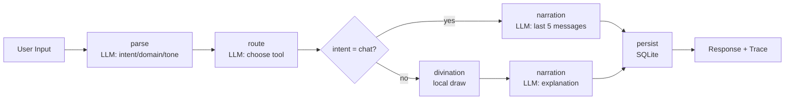

# Oracle's Choice

A small SpoonOS Graph Agent app that can either chat empathetically or run a divination on demand. The UI and the assistant are bilingual (中文 / English) — pick a language in the sidebar, and the bot replies in whatever language you type in.

## Screenshots


## Features

- Two modes: normal chat (with context) or forced divination via a button.
- Graph Agent workflow: `parse → route → divination → narration → persist`.
- LLM is used for intent / domain / tone / tool selection and for narration.
- Local divination engines (tarot / lenormand / liuyao) with a deterministic seed per session.
- Last 5 messages of a session are kept as context for chat replies.
- Full decision trace returned to the UI (deduped to 5 nodes per turn).
- Bilingual UI with an instant 中文 / English switch in the sidebar (choice persisted in `localStorage`).
- Bilingual chat: replies follow the user's input language; mixed input follows the dominant language.

## LLM provider

The active provider is Xiaomi MiMo (OpenAI-compatible Chat Completions API). DeepSeek is supported as an alternate provider in `backend/app/agent/llm_client.py` and is used automatically when only `DEEPSEEK_API_KEY` is set. The `LLMClient` wrapper itself is provider-agnostic; `backend/app/main.py` filters the active provider list based on which keys are present.

## Bilingual support

### UI

- A 中文 / English switcher sits in the sidebar.
- Switching is instant; the choice is saved to `localStorage` under `oracle.lang`.
- On first visit, the browser language is used (`zh-*` → Chinese UI, `en-*` → English UI; otherwise Chinese).
- The browser tab title and `<html lang>` follow the active language.
- All translations live in `frontend/src/i18n/translations.js`. To add a string, add the key to both the `zh` and `en` blocks and reference it via `t("key")`.

### Chatbot reply language

- Chinese input → Chinese reply.
- English input → English reply.
- Mixed input → the dominant language wins. CJK characters are weighted 3× to reflect their higher information density, so a short Chinese phrase mixed with a few English modifiers (e.g. `今天面试 a bit nervous`) stays Chinese, while an English sentence with a Chinese opener (e.g. `我感觉很 anxious about my interview tomorrow`) is treated as English.
- Empty / punctuation-only / ambiguous input defaults to Chinese.
- The assistant does not automatically translate the user's words. To get a translation, ask explicitly (e.g. *"Please translate this into English"* / *"请帮我翻译成英文"*).
- Detection happens in `backend/app/agent/lang.py` (`detect_language`). The detected value is threaded through agent state and shown in the parse trace as `lang`.

### Divination cards

- Card data (Tarot / Lenormand / Liuyao) stays in Chinese as authentic source material.
- The narration LLM rewrites verdict and advice into the user's language while preserving the reading's meaning.
- If the LLM call fails, a rule-based fallback returns Chinese for Chinese sessions and English for English sessions; in the rare English-fallback path, embedded card terms may still appear in Chinese.

## Architecture

### Backend workflow (SpoonOS Graph Agent)

```
parse (LLM) → route (LLM) → divination (local) → narration (LLM) → persist (db)
```

- `parse` — classifies intent (`chat` / `divination`), domain, tone, clarification need.
- `route` — picks the tool (`tarot` / `lenormand` / `liuyao`) for divination.
- `divination` — local draw with a deterministic seed.
- `narration` — generates the final response (chat or divination explanation).
- `persist` — writes message + reading + trace to SQLite.

### Frontend workflow

- User enters a prompt.
- Optional Divination button (sets `force_divination=true`; clicking with an empty textarea seeds a generic question in the active language so the request is never empty).
- Renders the response, plus the structured reading and trace when present.

## Project structure

```
Oracle-s-Choice/
├── backend/
│   ├── app/
│   │   ├── agent/
│   │   │   ├── graph_agent.py     # Graph Agent (language-aware prompts)
│   │   │   ├── lang.py            # bilingual language detector (zh / en)
│   │   │   ├── llm_client.py      # LLM wrapper with provider fallback
│   │   │   └── nodes.py           # rules, keywords, bilingual fallback narration
│   │   ├── divination/            # tarot / lenormand / liuyao
│   │   ├── storage/               # sqlite persistence
│   │   └── main.py                # FastAPI entry
│   ├── .env.example
│   └── requirements.txt
├── frontend/
│   ├── src/
│   │   ├── App.jsx
│   │   ├── components/
│   │   │   └── LanguageSwitcher.jsx   # 中文 / English toggle
│   │   ├── i18n/
│   │   │   ├── LanguageContext.jsx    # provider, useLanguage(), t(...)
│   │   │   └── translations.js        # zh / en dictionary
│   │   ├── main.jsx
│   │   └── styles.css
│   ├── index.html
│   ├── .env.example
│   └── package.json
└── README.md
```

## Requirements

- Python 3.12+ (required by SpoonOS).
- Node.js 18+ for the frontend.

## SpoonOS SDK setup

SpoonOS is not on PyPI; install it from source somewhere outside this repo, then point the backend at it.

```powershell
git clone https://github.com/XSpoonAi/spoon-core.git
cd spoon-core

py -3.12 -m venv spoon-env
.\spoon-env\Scripts\Activate.ps1
pip install -r requirements.txt
pip install -e .
```

## Backend setup

```powershell
cd Oracle-s-Choice\backend

py -3.12 -m venv .venv
.\.venv\Scripts\Activate.ps1

pip install -r requirements.txt
pip install -e <path-to-your-cloned-spoon-core>
```

### Environment variables

Copy the example file:

```powershell
copy .env.example .env
```

The active provider is Xiaomi MiMo, so the key you usually need is:

```
MIMO_API_KEY=your-mimo-key
```

Useful optional vars (full list lives in `backend/.env.example`):

- `MIMO_BASE_URL` — defaults to `https://api.xiaomimimo.com/v1`.
- `MIMO_MODEL` — defaults to `mimo-v2.5`.
- `DEEPSEEK_API_KEY` / `DEEPSEEK_BASE_URL` / `DEEPSEEK_MODEL` — alternate provider; used only when MiMo is not configured.
- `LLM_MAX_TOKENS` — token cap for parse / route classifier calls (default `512`).
- `LLM_NARRATION_MAX_TOKENS` — separate cap for the narration call (default `2048`). Reasoning models can spend many tokens on internal reasoning before they emit visible content, so narration uses a higher budget.
- `LLM_RETRIES` — retries per provider on failure (minimum 1).
- `LLM_TRACE_DEBUG` — set to `1` to expose the full upstream `raw_response_text` and `reasoning_content` in the per-attempt debug trace; off by default.
- `ORACLE_CHOICE_DB_PATH` — SQLite path; defaults to `oracle_choice.db` next to the backend.

`OPENAI_API_KEY` and `GEMINI_API_KEY` are recognized in `PROVIDER_KEYS` but not yet wired into the active provider list. Leave them blank unless you also extend `backend/app/main.py`.

Never commit a real `.env`. Only `.env.example` is tracked.

## Frontend setup

```powershell
cd Oracle-s-Choice\frontend
npm install
```

Create `.env` (frontend) if you need to override the backend URL:

```
VITE_API_URL=http://127.0.0.1:8001
```

## Run

### Backend

```powershell
cd backend
.\.venv\Scripts\Activate.ps1
python -m uvicorn app.main:app --reload --host 127.0.0.1 --port 8001
```

### Frontend

```powershell
cd frontend
npm run dev
```

## Chat vs divination

- Default: type a question and hit Send. The agent decides whether the turn is chat or divination based on intent.
- Divination button: forces the divination flow regardless of intent. Clicking it with an empty textarea seeds a generic question ("请为我现在的处境占卜一下。" / "Please draw a divination for my current situation.") so a request is always sent.
- Chat mode includes the last 5 messages of the session as context.

## API

### POST `/chat`

Request:

```json
{
  "session_id": "uuid-optional",
  "message": "user question",
  "force_divination": false
}
```

Response:

```json
{
  "session_id": "uuid",
  "message": "final response",
  "tool": "tarot|lenormand|liuyao|chat",
  "trace": [
    { "node": "parse", "input": {}, "output": {} },
    { "node": "route", "input": {}, "output": {} },
    { "node": "divination", "input": {}, "output": {} },
    { "node": "narration", "input": {}, "output": {} },
    { "node": "persist", "input": {}, "output": {} }
  ],
  "reading": {
    "symbols": [],
    "verdict": "...",
    "advice": ["...", "...", "..."]
  }
}
```

## Database

SQLite file: `backend/oracle_choice.db`. Tables: `sessions`, `messages`, `readings`, `agent_traces`.

## Troubleshooting

### `ModuleNotFoundError: spoon_ai`

SpoonOS isn't installed into the backend venv. Re-run:

```powershell
pip install -e <path-to-your-cloned-spoon-core>
```

### LLM errors / rate limits

- Confirm the relevant key is set (`MIMO_API_KEY`, or `DEEPSEEK_API_KEY` if you're falling back to DeepSeek) and the account has quota.
- Lower `LLM_MAX_TOKENS` or raise `LLM_RETRIES` in `.env`.
- Switch the model via `MIMO_MODEL` (default `mimo-v2.5`) or `DEEPSEEK_MODEL` (default `deepseek-chat`).
- If the narration message comes back empty or as the wrong language, raise `LLM_NARRATION_MAX_TOKENS`. Reasoning models sometimes hit `finish_reason=length` before emitting any content; the wrapper treats that as a failure and falls through to the rule-based narration.

### Frontend not hitting backend

- Ensure `frontend/.env` has the correct `VITE_API_URL`.
- Restart `npm run dev` after editing the env file.

## Notes

- Divination draws are local and deterministic.
- The LLM is used for intent, routing, and narration only.
- The trace is always returned and surfaced in the UI for transparency.

## Deployment notes

This project is configured for local development. Items below are reminders for when you put it on a public server; none of them are wired up in the current code.

1. CORS — `backend/app/main.py` uses `allow_origins=["*"]`. Restrict it to your real frontend domain(s) before going public.
2. API keys — never commit `.env`. Provide `MIMO_API_KEY` (or `DEEPSEEK_API_KEY`) only via the server's environment. `.env` and `.env.*` are already in `.gitignore`.
3. Persistent storage — SQLite writes to `backend/oracle_choice.db`. In a container or PaaS, mount a persistent volume or set `ORACLE_CHOICE_DB_PATH` so messages and traces survive restarts.
4. Rate limiting — `/chat` triggers paid LLM calls on every request. Add a per-IP limit (Nginx `limit_req`, `slowapi`, etc.) before launch.
5. HTTPS / reverse proxy — terminate TLS at Nginx or Caddy and proxy to `uvicorn` on `127.0.0.1:8001`. Run uvicorn with multiple workers behind a process manager.
6. Frontend build & host — `npm run build` in `frontend/` produces `dist/`, which any static host can serve. Set `VITE_API_URL` at build time to your public backend URL.
7. Logging — the `print(...)` calls at startup in `backend/app/main.py` are fine for development; switching to the `logging` module is cleaner for production.
8. `.env.example` — keep it free of real values, even on private branches.

## License

MIT (or project default — update if needed).

---

# 详细项目解说

这个项目想做的事，是把"占卜"从一次性的仪式感体验，做成一个可解释、可追踪、可切换模式的对话产品。用户并不是每次都想抽牌，有时只是想被听见，所以同一套工作流里同时支持聊天模式和占卜模式。

## 1) 为什么要做"双模式"

传统占卜应用容易出现两个问题：

- 用户输入任何内容都会被强行抽牌，体验割裂。
- 没有上下文记忆，情绪表达会被仪式流程打断。

这里的处理是：

- 聊天模式：不抽牌，仅基于上下文对话。
- 占卜模式：强制进入抽牌流程。
- 自动判断：不点按钮时由 LLM 判定意图。

## 2) 工作流逻辑

### 2.1 解析节点（parse）

- 输入：用户问题。
- LLM 输出：`intent`（chat/divination）、`domain`（love/career/general）、`tone`（gentle/direct）。
- 本地规则作为 fallback，确保低配额时仍可运行。

### 2.2 路由节点（route）

- 当 `intent=chat`：直接标记 `tool=chat`，不进入抽牌。
- 当 `intent=divination`：LLM 从塔罗 / 雷诺曼 / 六爻中选择最合适的工具。

### 2.3 占卜节点（divination）

- 只在占卜模式触发。
- 使用本地随机种子 + 问题 + `session_id`。
- 输出 `symbols / verdict / advice`。

### 2.4 解读节点（narration）

- 聊天模式：拼接最近 5 条上下文，生成自然对话。
- 占卜模式：让 LLM 把 verdict / advice 明确映射回用户的问题。

### 2.5 持久化节点（persist）

- 保存 messages / readings / trace。
- trace 经过标准化输出，保证始终是 5 个节点便于可视化。

## 3) 用户体验

### 3.1 占卜按钮

- Send：自动判断。
- Divination：强制进入占卜流程；空输入时会自动用一句通用提问发起请求。

### 3.2 透明决策过程

每次对话都会返回 Agent trace，可以展开查看：

```
parse → route → divination → narration → persist
```

## 4) 真实场景示例

### 场景 A：情绪倾诉（聊天模式）

输入：

> "我最近很累，但不知道怎么说出口。"

系统：

- intent=chat
- 生成温柔回应
- 保留上下文便于持续对话

### 场景 B：明确占卜（按钮开启）

输入：

> "这段感情还有机会吗？"

系统：

- 强制 intent=divination
- route 选择雷诺曼
- 抽牌 → 解读 → 给出结论

## 5) SpoonOS 的角色

- Graph Agent：所有节点由 StateGraph 串联。
- LLM Provider 统一管理：当前主用 Xiaomi MiMo，DeepSeek 作为备选；`LLMClient` 包装层与提供商无关，未来加 OpenAI / Gemini 也只需要在 `backend/app/main.py` 的过滤列表里追加。
- 可解释性：trace 完整返回。
- 拓展性：以后可以新增"自定义占卜流派"或"工具节点"。

## 6) 后续可扩展方向

- 多轮意图确认（例如"你是想聊天还是占卜？"）。
- 占卜卡牌图库展示。
- 情绪日志归档。
- 链上记录占卜与情绪趋势。

## Flowchart


